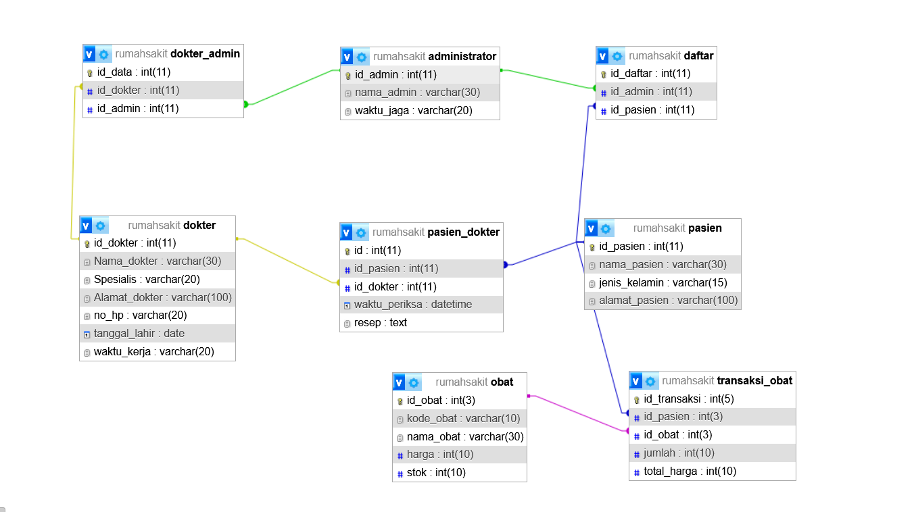

# 🏥 Mini Project MySQL: Sistem Informasi Rumah Sakit / Hospital Information System

> **English version: see below**

---

**Author:** Zidan6656  
**Source:** Self-made, college/personal project  
**License:** Free to use for learning purposes  

---

## 📖 Daftar Isi
- [Deskripsi (Bahasa Indonesia)](#-deskripsi-bahasa-indonesia)
- [Fitur Database](#-fitur-database)
- [File](#-file)
- [Cara Menggunakan](#-cara-menggunakan)
- [Daftar Tabel Utama](#-daftar-tabel-utama)
- [Prosedur & Trigger](#-prosedur--trigger)
- [ERD - Entity Relationship Diagram](#erd---entity-relationship-diagram)
- [Video Dokumentasi](#-video-dokumentasi)
- [Catatan](#-catatan)

---

## 📌 Deskripsi (Bahasa Indonesia)

Ini adalah mini project basis data MySQL untuk simulasi sistem informasi rumah sakit.  
Proyek ini berisi struktur database, data contoh, prosedur, dan trigger yang dapat digunakan untuk pembelajaran atau portofolio.

---

## 🗂 Fitur Database
- Tabel data **administrator**, **dokter**, **pasien**, **obat**, dan relasi terkait  
- Prosedur untuk simulasi transaksi database  
- Trigger untuk stok obat setiap transaksi  
- Contoh data (dummy data) di beberapa tabel  

---

## 📂 File
- `rumahsakit.sql` → SQL dump dari phpMyAdmin (tables, procedures, triggers, relations, sample data).  
- `erd.png` → Entity Relationship Diagram (lihat di bawah).  
-  query_examples.sql` → Sample SQL queries.  

---

## ⚡ Cara Menggunakan
1. Siapkan MySQL & phpMyAdmin.  
2. Buat database baru, misal `rumahsakit`.  
3. Import file `rumahsakit.sql` via phpMyAdmin (menu **Import**).  
4. Cek tabel & data sudah masuk ke database.  

---

## 📊 Daftar Tabel Utama

| Tabel            | Deskripsi                                         |
|------------------|---------------------------------------------------|
| administrator    | Data admin rumah sakit                            |
| dokter           | Data dokter                                       |
| pasien           | Data pasien                                       |
| obat             | Data obat                                         |
| pasien_dokter    | Relasi pasien-dokter & resep                      |
| transaksi_obat   | Transaksi pembelian obat                          |
| daftar           | Relasi pasien ke admin                            |
| dokter_admin     | Relasi dokter-admin                               |

---

## 🔄 Prosedur & Trigger
- **Stored Procedures** → contoh transaksi insert/update data pasien.  
- **Trigger** → otomatis mengurangi stok obat setelah transaksi obat.  

---

## ERD - Entity Relationship Diagram

---

## 🎥 Video Dokumentasi
Klik thumbnail berikut untuk menonton penjelasan lengkap di YouTube:

Atau akses link: https://www.youtube.com/watch?v=D5M8y6vJb5w

---

## 📝 Catatan
- Project ini adalah contoh sederhana untuk pembelajaran database.  
- Bisa dikembangkan lebih lanjut sesuai kebutuhan.  

---

<b>English Version (click to expand)</b>

## 📖 Table of Contents
- [Description (English Language)](#-desciption-english-language)
- [Database Feature](#-database-feature)
- [Files](#-files)
- [How to Use](#-how-t0-use)
- [Main Tables](#-main-tables)
- [Procedures & Triggers](#-prosedures--triggers)
- [ERD - Entity Relationship Diagram](#erd---entity-relationship-diagram)
- [Documentation Video](#-documentation-video)
- [Notes](#-notes)

---

## 📌 Description (English Language)
This is a MySQL database mini project that simulates a hospital information system.
The project contains the database structure, sample data, stored procedures, and triggers that can be used for learning or as part of a portfolio.

---

## 🗂 Database Feature
- Tables for administrator, doctor, patient, medicine, and related relations  
- Stored procedures for simulating database transactions  
- Trigger to update medicine stock after each transaction  
- Example (dummy) data in several tables  

---

## 📂 Files
- `rumahsakit.sql` → SQL dump from phpMyAdmin (tables, procedures, triggers, relations, sample data).  
- `erd.png` → Entity Relationship Diagram (see below).  
-  query_examples.sql` → Sample SQL queries.  

---

## ⚡ How to Use
1. Prepare MySQL & phpMyAdmin.  
2. Create a new database, e.g., `rumahsakit`.  
3. Import files `rumahsakit.sql` via phpMyAdmin (**Import** menu).  
4. Check that the tables and data are successfully imported into the database

---

## 📊 Main Tables

| Table            | Description                                       |
|------------------|---------------------------------------------------|
| administrator    | Hospital admin data                               |
| dokter           | Doctor data                                       |
| pasien           | Patient data                                      |
| obat             | Medicine data                                     |
| pasien_dokter    | Patient-doctor link                               |  
| transaksi_obat   | Medicine transactions                             |
| daftar           | Patient registration                              | 
| dokter_admin     | Doctor-admin relation                             |

---

## 🔄 Procedures & Triggers
- **Stored Procedures** → example transactions for inserting/updating patient data.  
- **Trigger** → automatically decreases medicine stock after each transaction.  

---

## ERD - Entity Relationship Diagram

---

## 🎥 Documentation Video
Click the thumbnail below to watch the full explanation on YouTube::

Or access the link: https://www.youtube.com/watch?v=D5M8y6vJb5w

---

## 📝 Notes
- This project is a simple example for database learning..  
- Can be further developed according to needs.  

---

> **Author:** Zidan6656  
> **Lisensi/License:** Free for learning
